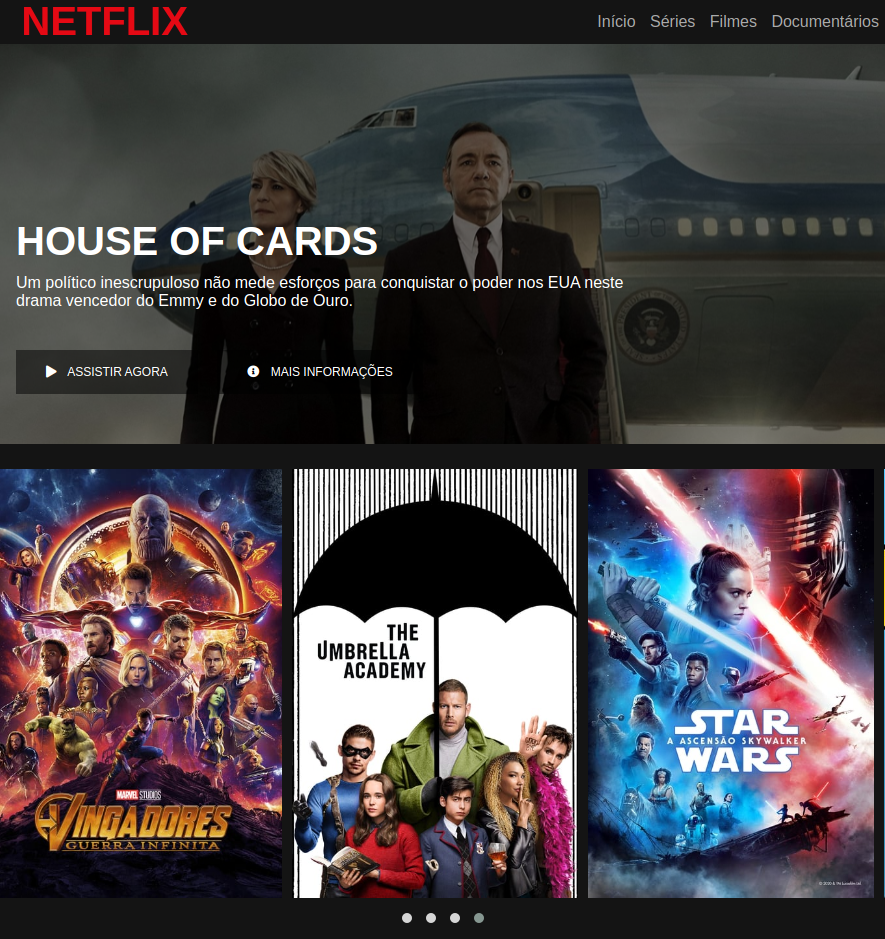

## Projeto - Digital Innovation One
### Descrição 
Criando um clone do Netflix utilizando HTML5, CSS3, Flexbox e jQuery através do projeto de Bootcamp HTML Web Developer da Digital Innovation One.

### TODO
* Fazer novas melhorias
* Links para vídeos - dar vida a botões da tela.
* Uma nova roupagem da página, re-design
* Botão para marcar filmes vistos.

Link do código original: https://github.com/felipeAguiarCode/netflix-clone
### Tela
